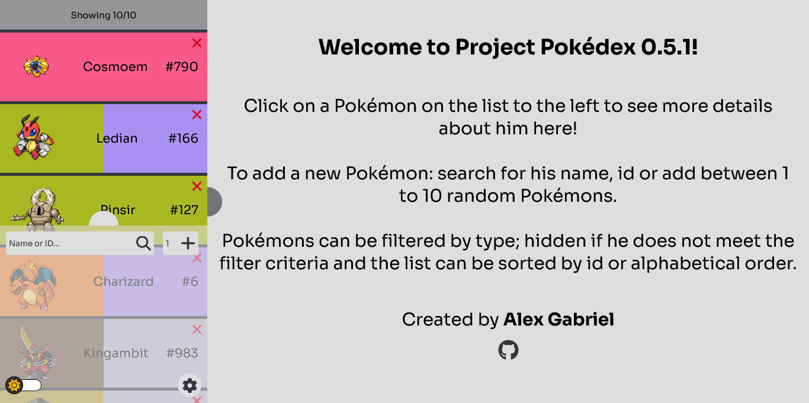
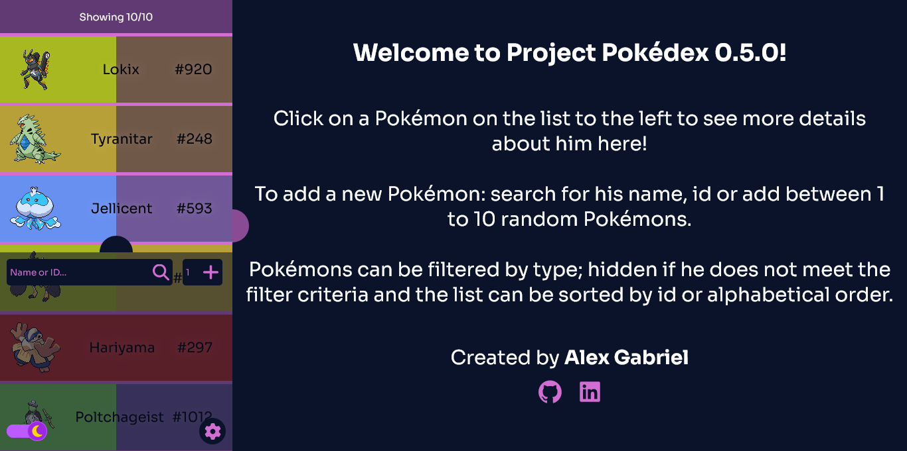
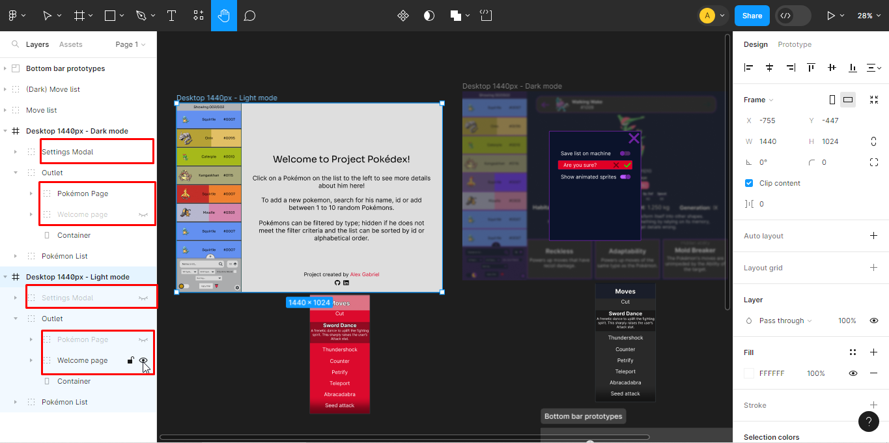

# Summary

- [The Project](#the-project)
   - [My Process](#my-process)
      - [Design/Prototype](#designprototype)
      - [Initial Coding Difficulties](#initial-coding-difficulties)
      - [After Version 0.2.0](#after-version-020)
   - [Functionalities](#functionalities)
   - [Built With](#built-with)
- [Using the Project](#using-the-project)
   - [Installation](#installation)
      - [Pre-requisites](#pre-requisites)
      - [Steps](#steps)
   - [Testing](#testing)
   - [Linting + Formatting](#linting--formatting)

# The Project (Work in Progress)

(<b><abbr title="Work in progress">WIP</abbr></b>) This is a Quest, a special exercise from the [DevQuest](https://br.linkedin.com/school/devquest-dev-em-dobro/) course where I have to come up with my own design and implementation of a <abbr title="Single Page Application">SPA</abbr> that fetches Pokémons from the [PokéAPI](https://pokeapi.co/) and exhibit them on a list initially containing 10.

 

## My Process

   
A bit of my development journey...

   What was supposed to be an exercise for a course, became a personal project when I got excited to implement many extra things that weren't asked.

   ### Design/Prototype

   If you want to check the Project's [design](https://www.figma.com/file/5D3noXVHYhTpYkDuyM9ttH), change the visibility of the Settings Modal and the pages inside Outlet in order to see only the part you want:
   

   There were many things I wanted to develop, but I needed something to visualize them all working together, which made me create my first [Figma design](https://www.figma.com/file/5D3noXVHYhTpYkDuyM9ttH).

   This part was already challenging, because I had to decide what I would implement, how they should look and if they were feasible.

   For the themes, I tried choosing colors that reminded something about Pokémon. The light theme used the Pokédex's red and a light gray to simulate the lit screen. The dark theme colors were inspired in the Master Ball.

   I wanted to create a theme structure that would allow me to use both light and dark themes by coding few conditionals, this led me to devise an object structure for them and create two versions of the app in my Figma design, to see if the colors looked good on both themes.

   ### Initial Coding Difficulties

   Being my first personal project and one with a complexity I never dealed before, it was difficult coding it, with some highlights being:

   - Had to search and even ask ChatGPT for help with TypeScript because I recently started learning it when I decided to use on the Project.

   - Implementing two sections with their own scroll — the Pokémon List and the Outlet — that would smoothly adjust their sizes whenever the list was toggled open/closed along with creating top and bottom bars that would follow the user's scroll on the list required a lot of trial and error.

   - How to store the Pokémons and how to manage its manipulation, from recovering from Local Storage to adding multiple Pokémons one after the other to the list.

   ### After Version 0.2.0

   Since the basic structure of the project was done by version 0.2.0, I could focus more on the new features themselves, which reduced a bit of the complexity of developing the project.

   There was another reason for development to get easier: it took a lot of time to reach this version, which allowed me to improve as a developer and code future ones better.

## Functionalities

   
A list of Pokémons that:

   - Is initially populated with 10 Pokémons fetched from the PokéAPI or recovered from user's Local Storage if saved there.
   - Can be increased by typing the Pokémon's name or ID or by letting the App get 1 to 10 random ones.
   - Exhibits amount of Pokémons inside it.
   - (WIP) Can sort Pokémons by ID, name or type(s).
   - (WIP) Can filter by type(s).

   
Page containing details of a Pokémon:

      - Shows Pokemon artwork, name, ID, Genus, types, stats, habitat, height, weight, generation, description, abilities and moves.
      - Shows previous and next Pokémons based on the ID of the current Pokémon.

   
Theme:

   - Starts with light or dark theme depending on user's preference.
   - Toggle between light and dark themes.

   
Settings:

   - Let user choose animated or static sprites for the Pokémon List.
   - Allow to save or not Pokémon List in Local Storage.
   - Empty the Pokémon List.

## Built With

Kickstarted with <strong>[Vite](https://vitejs.dev/)</strong> using the following technologies:

- <strong>HTML5, CSS3</strong>: Provides necessary structure and styling for the app.

- <strong>JavaScript + [TypeScript](https://www.typescriptlang.org/)</strong>: JS allows interactions with the app and TS makes JS code type-safe, less prone to bugs.

- <strong>[React](https://react.dev/)</strong>: Makes the user experience smoother by turning the App in a <abbr title="Single Page Application">SPA</abbr> and forces code to be written as components, facilitating maintanence and development of new features.

   - <strong>[Styled Components](https://styled-components.com/)</strong>: Isolate styles, making them easier to be created, maintaned and escalated.

   - <strong>[React Router DOM](https://reactrouter.com/)</strong>: Further improves user experience by leaving the routing to the Browser, allowing it to download only what has changed on the screen, instead of downloading everything again.

- <strong>[Vitest](https://vitest.dev/)</strong>: For testing the project.

- Some <strong>[Testing Library](https://testing-library.com/)</strong> libraries:
   - <strong>[React Testing Library](https://testing-library.com/docs/react-testing-library/intro/)</strong>: Make tests with React Components.
   - <strong>[User event](https://testing-library.com/docs/user-event/intro/)</strong>: Test events (mouse click, keyboard typing, etc.) with more accuracy.
- <strong>[ESLint](https://eslint.org/)</strong>: Linter used to detect bugs in code.

- <strong>[Prettier](https://prettier.io/)</strong>: Code formatter used to make the code visually better and standardized.

# Using the project

This section will explain how to install and use the project.

## Installation

Want to test it in your own machine? Check the following guide:

### Pre-requisites

- Git
- A package manager (I used NPM which is installed together with [Node.js](https://nodejs.dev))

### Steps

1. (Optional) Fork the project

2. Run in the terminal: `git clone https://github.com/alexgabriel8/results-summary-component.git`
   - <b>If you have forked the project</b>, substitute alexgabriel8 by your username.

3. Enter the folder created by the clone and install its dependencies. (Using NPM: `npm i` or `npm install`)

4. After installing, run the `dev` script (Using NPM: `npm run dev`) and paste the resulting URL on the Browser to see the project running!

## Testing

Run the `test` script in the terminal to run all tests. (Using NPM: `npm run test`)

## Linting + Formatting

You can run the `lint` script in the terminal (Using NPM: `npm run lint`) or use VS Code with the ESLint extension to see errors in real time.

Running the `format` script with your Package Manager will make Prettier format all files inside the src folder. (Using NPM: `npm run format`)